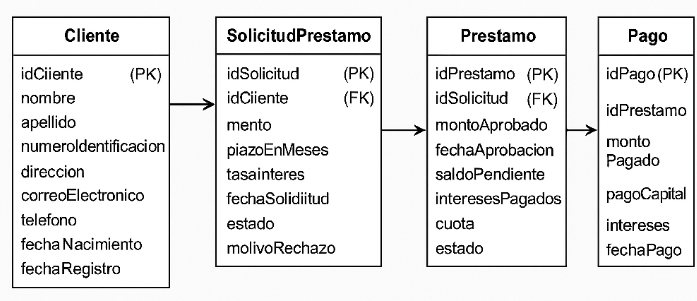

# 🏦 CHN - Sistema Web de Préstamos

Proyecto práctico para la administración de clientes, solicitudes de préstamo, préstamos y pagos, desarrollado en Java 17 con Spring Boot y SQL Server.

## 📦 Tecnologías
- Java 17
- Spring Boot
- Spring Data JPA
- SQL Server (2019)
- Angular + PrimeNG
- Docker + Docker Compose
- Lombok
- JUnit + Mockito

---

## ⚙️ Requisitos

- Docker y Docker Compose
- Java 17
- Maven 3.8+

---

## 🚀 Ejecución rápida con Docker

### 1. Clonar el repositorio
```bash
git clone https://github.com/Jony198/ExamenCHNDeveloper.git
cd chn-backend
```

### 2. Levantar todo el entorno
```bash
docker-compose up -d
```

Esto levanta:
- **SQL Server** en `localhost:1433`
- **Backend Spring Boot** en `http://localhost:8080`
- **Frontend Angular** en `http://localhost:4200`

---

## Entidad Relacion



## 🔧 Endpoints disponibles

| Método | URL                                      | Descripción                          |
|--------|------------------------------------------|--------------------------------------|
| GET    | `/api/clientes`                         | Listar clientes                      |
| POST   | `/api/clientes`                         | Crear cliente                        |
| PUT    | `/api/clientes/{id}`                    | Actualizar cliente                   |
| DELETE | `/api/clientes/{id}`                    | Eliminar cliente                     |
| GET    | `/api/solicitudes`                      | Listar solicitudes de préstamo       |
| GET    | `/api/solicitudes/{id}`                 | Obtener solicitud por ID             |
| POST   | `/api/solicitudes`                      | Crear solicitud                      |
| PUT    | `/api/solicitudes/estado`               | Aprobar o rechazar solicitud         |
| GET    | `/api/prestamos`                        | Listar préstamos                     |
| GET    | `/api/prestamos/{id}`                   | Obtener préstamo por ID              |
| POST   | `/api/prestamos`                        | Crear préstamo (a partir de solicitud) |
| DELETE | `/api/prestamos/{id}`                   | Eliminar préstamo                    |
| GET    | `/api/pagos/historial/{idPrestamo}`     | Obtener historial de pagos           |
| POST   | `/api/pagos`                            | Registrar nuevo pago                 |

---


Incluye pruebas para:
- ClienteService
- SolicitudPrestamoService
- PrestamoService
- PagoService

---

## 📁 Estructura del Proyecto

```
src/
├── main/java/com/examen/demo
│   ├── controller
│   ├── entity          # ErrorEntity, ErrorList, AbstractResponse
│   ├── model           # Cliente, SolicitudPrestamo, Prestamo, Pago
│   ├── repository
│   ├── response        # ClienteResponse, SolicitudPrestamoResponse, etc.
│   └── service
├── resources/
│   └── application.properties
└── test/
    └── java/com/examen/demo/service/
```

---

## 🧠 Notas

- Usuario de SQL Server: `sa`
- Contraseña: `Password12345`
- Base de datos: `BancoCHN`
